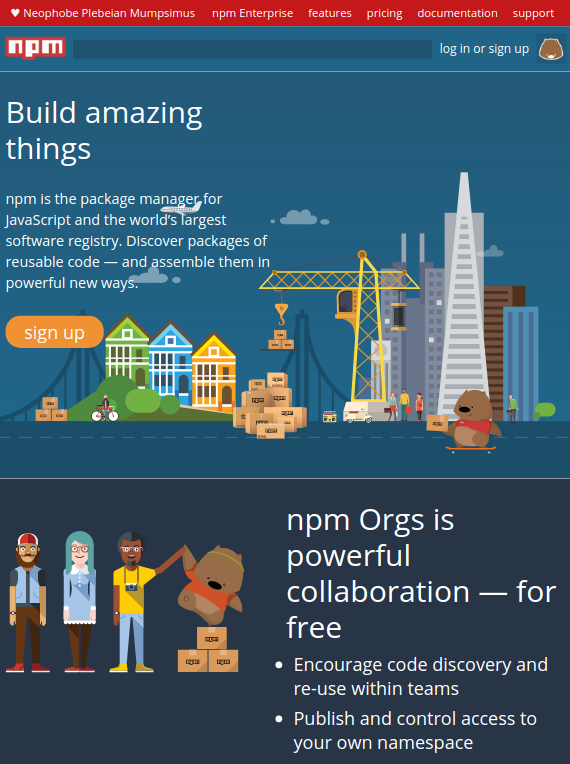

# HTML y CSS
---

Clonar una landing page utilizando únicamente HTML y CSS 

## Requisitos y tecnologías:  
- Responsive
- HTML 
- CSS

# Comenzando
## Pre-requisitos  

Navegador donde correr la aplicación

## Visualizar el proyecto

Varias opciones:
- Puedes simplemente arrastrar y soltar el archivo HTML directamente en una nueva pestaña de Chrome, este abrirá automáticamente la página.
- Busca el archivo HTML que deseas ver, haz clic derecho sobre él y elije **Abrir con** del menú. Verás una lista completa de aplicaciones que puedes usar para ejecutar tu archivo. Tu navegador predeterminado estará en la parte superior de la lista.
Selecciona Google Chrome de la lista y visualiza tu archivo en el navegador.

### Preview

## Autor  
Lucía Glez.

